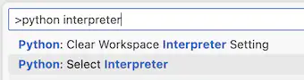
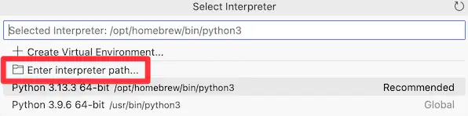
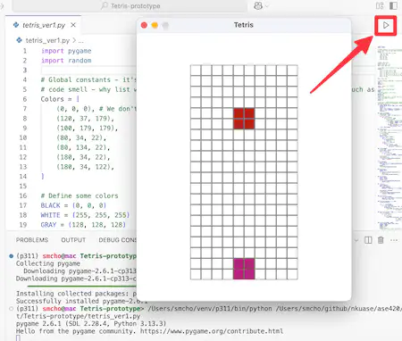
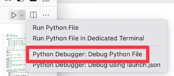
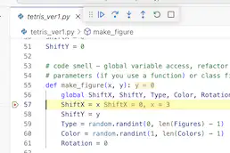
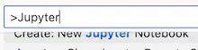

<!-- _class: lead -->
<!-- _class: frontpage -->
<!-- _paginate: skip -->

# ASE 420 Tools Installation

---

- Python
  - Python interpreter
  - Virtual environment and PIP

---

## Python

- Install Python
  - [Download Python | Python.org](https://www.python.org/downloads/)
- Always use a virtual environment (venv)
  - It isolates your working environment.
  - With PIP, you can install packages only for the venv.

---

- Learn how to use venv.
  - [Install packages in a virtual environment using pip and venv - Python Packaging User Guide](https://packaging.python.org/en/latest/guides/installing-using-pip-and-virtual-environments/)
- When you are using venv, the command line shows the directory of the venv: for example, (p3), at the prompt.

```bash
(p3) chos5@NKU023R7042 ase420> 
```

---

- This is an example to start venv on Mac/Linux.

```bash
python -m venv ~/venv/p3
source ~/venv/p3/bin/activate 
```

- This is an example to start venv on Windows.

```bash
python -m venv C:\Users\YourUsername\venv\p3
C:\Users\YourUsername\venv\p3\Scripts\activate.bat
```

---

### Python Packages

- Under the virtual environment, use pip to install packages.
- Install pygame for the course project.
- Install jupyter for interactive Python application development.

```bash
pip install pygame
pip install jupyter
```

---

### When you have any issues

- Remember you are `the problem solver`.
- Develop your `debugging skills` as a professional software engineer.
- `Start early` to identify the issues as early as possible

---

#### Ask for help

- You don't have much time to lose, especially for the installation.
- Ask other team members who successfully installed Flutter.
- Use my office hours to visit and ask.

---

#### Discuss the issue with LLM

- Copy the error message to LLM.
- Use multiple LLMs when one LLM doesn't give you the correct answers.
- In the AI age, your time is more important than AI time.
- `Learn to work with LLM`, not following LLM's instructions; this is too dangerous.

---

## Check if you have all the ASE Common tools

- Visual Studio Code
- Markdown/Marp
- Git/GitHub

---

### Visual Studio Extension

- We use Visual Studio Code as the primary IDE.
  - Install Python extensions.
  - Install any extension for your application development.

---

## Run the Tetris programs

- git clone the ASE420 course from [https://github.com/nkuase/ase420](https://github.com/nkuase/ase420)
- Using the command line, run the Python Tetris program in venv.

```bash
> cd project/Tetris-prototype
> pip install pygame
> python tetris_ver1.py
```

---

### Run Tetris in VSC

- Install the Python extension in VS Code.
- Open the Tetris program in VSC.
  - Select Python interpreter and enter the Python of the venv.

<style>
.columns {
  display: flex;
  gap: 0rem !important;  
}
</style>

<div class="columns">
  <div class="column">



  </div>
  <div class="column">



  </div>
</div>

---

- Click the arrow to run the app.
- Install `pygame` using `pip` in your `venv`.



---

#### Debugging the App

- Use VSC: choose Python debugger and set breakpoints.

<div class="columns">
  <div class="column">



  </div>
  <div class="column">



  </div>
</div>

---

#### Use Jupyter

- Install Jupyter extension & set Python environment as your venv Python.

<br>



---

- Use Jupyter to learn Python and analyze the Tetris program.

<br>


